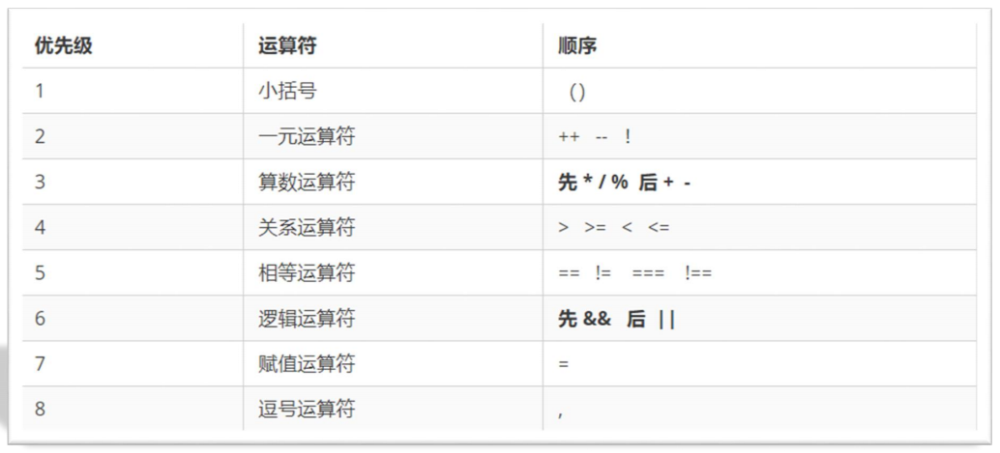
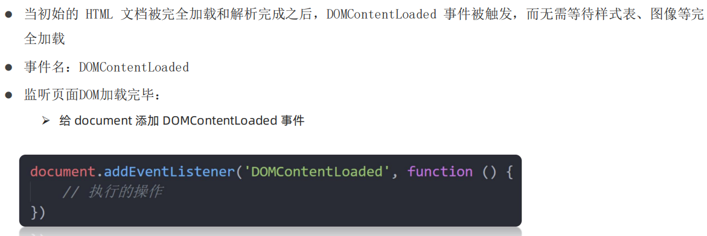
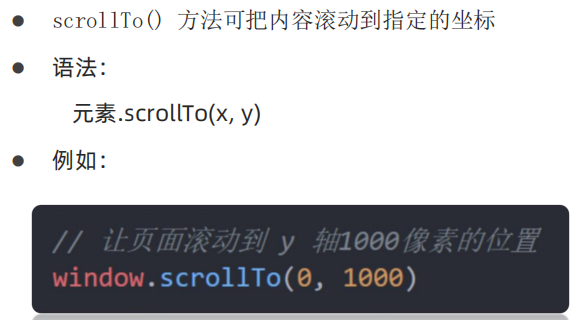

# JavaScript 基础

## 1.代码形式


### 内部形式：

通过 `script` 标签包裹 JavaScript 代码

```html
<body>
  <!-- 内联形式：通过 script 标签包裹 JavaScript 代码 -->
  <script>
    alert('嗨，欢迎学习前端技术！')
  </script>
</body>
```

### 外部形式：

一般将 JavaScript 代码写在独立的以 .js 结尾的文件中，然后通过 `script` 标签的 `src` 属性引入

```javascript
// demo.js
document.write('嗨，欢迎来传智播学习前端技术！')
```

```html
<body>
  <!-- 外部形式：通过 script 的 src 属性引入独立的 .js 文件 -->
  <script src="demo.js"></script>
</body>
```

如果 script 标签使用 src 属性引入了某 .js 文件，标签内的代码会被忽略，如下代码所示：

```html
<body>
  <!-- 外部形式：通过 script 的 src 属性引入独立的 .js 文件 -->
  <script src="demo.js">
  	alert(666) //此处的代码会被忽略
  </script>
</body>
```

## 2.注释和结束符

### 单行注释：

使用 `// ` 注释单行代码

**注：编辑器中单行注释的快捷键为 `ctrl + /`**

```html
<body>
  <script>
    // 这种是单行注释的语法
    // 一次只能注释一行
    // 可以重复注释
    document.write('嗨，欢迎学习前端技术！')
  </script>
</body>
```

### 多行注释：

使用 `/* */` 注释多行代码

**注：编辑器中多行注释的快捷键为 `shift + alt + A`**

```html
<body>
  <script>
    /* 这种的是多行注释的语法 */
    /*
    	更常见的多行注释是这种写法
    	在些可以任意换行
    	多少行都可以
      */
    document.write('嗨，欢迎学习前端技术！')
  </script>
</body>
```

### 结束符：

在 JavaScript 中 `;` 代表一段代码的结束，多数情况下可以省略 `;` 使用回车（enter）替代。

```html
<body>
  <script> 
    alert(1);
    alert(2);
    alert(1)
    alert(2)
  </script>
</body>
```

## 3 输入和输出

### 输入：

`prompt()` 用于提示并接收输入

### 输出：

`alert()`弹出警告内容、`document.wirte()`用于文档输出、`console.log()`可以在控制台输出，常用于调试

```html
<body>
  <script> 
    document.write('要输出的内容')
    alert('要输出的内容')
    prompt('请输入您的姓名:')
  </script>
</body>
```

## 4. 声明和赋值

### 声明：

声明(定义)变量有两部分构成：声明关键字、变量名（标识）

```html
<body>
  <script> 
    // let 变量名
    // let 即关键字，是系统提供的专门用来声明（定义）变量的词语
    // age 即变量的名称，也叫标识符
    let age
  </script>
</body>
```

### 赋值：

声明（定义）变量相当于创造了一个空的“容器”，通过赋值向这个容器中添加数据

```html
<body>
  <script>
    let age
    // 赋值，将 18 这个数据存入了 age 这个“容器”中
    age = 18
    // 这样 age 的值就成了 18
    document.write(age)
    
    // 也可以声明和赋值同时进行
    let str = 'hello world!'
    alert(str)
  </script>
</body>
```

## 5. 关键字  

使用 `let` 时的注意事项：

1. 允许声明和赋值同时进行
2. 不允许重复声明同一个变量
3. 允许同时声明多个变量并赋值
4. JavaScript 中内置的一些关键字不能被当做变量名

## 6. 变量名命名规则

关于变量的名称（标识符）有一系列的规则需要遵守：

（1）只能是字母、数字、下划线、$，且不能以数字开头

（2）字母区分大小写，如 Age 和 age 是不同的变量

（3）JavaScript 内部已占用于单词（关键字或保留字）不允许使用

（4）尽量保证变量具有一定的语义，见字知义

## 7.数据类型

注：可以通过 typeof 关键字检测数据类型

```html
<body>
  <script> 
    // 检测 1 是什么类型数据，结果为 number
    document.write(typeof 1)
  </script>
</body>
```

### 数值类型：

即我们数学中学习到的数字，可以是整数、小数、正数、负数

```html
<body>
  <script> 
    let score = 100 // 正整数
    let price = 12.345 // 小数
    let temperature = -40 // 负数

    document.write(typeof score) // 结果为 number
    document.write(typeof price) // 结果为 number
    document.write(typeof temperature) // 结果为 number
  </script>
</body>
```

### 字符串类型：

通过单引号（ `''`） 、双引号（ `""`）或反引号包裹的数据都叫字符串，单引号和双引号没有本质上的区别，推荐使用单引号

注意事项：

1. 无论单引号或是双引号必须成对使用
2. 单引号/双引号可以互相嵌套，但是不以自已嵌套自已
3. 必要时可以使用转义符 `\`，输出单引号或双引号

```html
<body>
  <script> 
    let user_name = '小明' // 使用单引号
    let gender = "男" // 使用双引号
    let str = '123' // 看着是数字，但是用引号包裹了就成了字符串
    let str1 = '' // 这种情况叫空字符串
		
    documeent.write(typeof user_name) // 结果为 string
    documeent.write(typeof gender) // 结果为 string
    documeent.write(typeof str) // 结果为 string
  </script>
</body>
```

### 布尔类型：

表示肯定或否定时在计算机中对应的是布尔类型数据，它有两个固定的值 `true` 和 `false`，表示肯定的数据用 `true`，表示否定的数据用 `false`。

```html
<body>
  <script> 
    let isCool = true
    isCool = false

    document.write(typeof isCool)// 结果为 boolean
  </script>
</body>
```

### undefined：

未定义是比较特殊的类型，只有一个值 undefined，只声明变量，不赋值的情况下，变量的默认值为 undefined

```html
<body>
  <script> 
    // 只声明了变量，并末赋值
    let tmp;
    document.write(typeof tmp) // 结果为 undefined
  </script>
</body>
```

### null：

null为空类型，表示值为空

null 和 undefined 区别：

1. undefined 表示没有赋值

2. null 表示赋值了，但是内容为空

```html
<body>
  <script> 
    let obj = null
    document.write(typeof tmp) // 结果为 null
  </script>
</body>
```

**注：JavaScript 中变量的值决定了变量的数据类型。**

## 8.模版字符串

作用：拼接字符串和变量

符号：\``，拼接变量时用`${}`包住变量

```html
<body>
  <script>
      let name = pink
      let age = 18
      document.write(`大家好，我叫${name},今年${age}岁`)
  </script>
</body>
```

## 9.数组

注意事项：

1. 数组是按顺序保存，所以每个数据都有自己的编号
2. 计算机中的编号从0开始，所以小明的编号为0，小刚编号为1，以此类推
3. 在数组中，数据的编号也叫**索引或下标**
4. 数组可以存储任意类型的数据
5. 数组中保存的每个数据都叫数组元素
6. 数组中数据的个数，通过数组的length属性获得

```html
<body>
  <script> 
    let name = ['小明','小刚','小红']
    
    console.log(name[0]) //小明
    console.log(name[1]) //小刚
    console.log(name.length) //3
  </script>
</body>
```

## 10.隐式转换

某些运算符被执行时，系统内部自动将数据类型进行转换，这种转换称为隐式转换

注意事项：

1. \+ 号两边只要有一个是字符串，都会把另外一个转成字符串

2. 除了+以外的算术运算符 比如 - * / 等都会把数据转成数字类型

3. +号作为正号解析可以转换成数字类型

   

```html
<body>
  <script> 
    let num = 13; // 数值
    let num2 = '2'; // 字符串

    // 结果为 132
    // 原因是将数值 num 转换成了字符串，相当于 '13'
    // 然后 + 将两个字符串拼接到了一起
    console.log(num + num2);

    // 结果为 11
    // 原因是将字符串 num2 转换成了数值，相当于 2
    // 然后数值 13 减去 数值 2
    console.log(num - num2);
      
    // 结果为 15
    // +号作为正号解析将num2转换成了数字
    console.log(+num2 + num);
  </script>
</body>
```

## 11.显式转换

### Number：

通过 `Number()` 显示转换成数值类型，如果字符串内容里有非数字，转换失败时结果为 `NaN`（Not a Number）即不是一个数字，但`NaN`也是number类型

```html
<body>
  <script>
    let t = '12';
    let f = 8;

    // 显式将字符串 12 转换成数值 12
    t = Number(t);

    // 检测转换后的类型
    // console.log(typeof t);
    console.log(t + f); // 结果为 20

    // 并不是所有的值都可以被转成数值类型
    let str = 'hello';
    // 将 hello 转成数值是不现实的，当无法转换成
    // 数值时，得到的结果为 NaN （Not a Number）
    console.log(Number(str));
  </script>
</body>
```

### parseInt：

通过 `parseInt()` 只保留整数

### parseFloat：

通过 `parseFloat()` 只保留小数

### String：

通过 `String()` .显示转换为字符串

### Boolean：


## 12.运算符

### 赋值运算符：

+=、-=、*=、/=、%=

### 一元运算符：

++、--

```html
<body>
    <script>
        let i = 1
        ++i //前置自增，先自增再运算
        i++ //后置自增，先运算在自增
    </script>
</body>
```

### 比较运算符：

\>、<、>=、<=、==（判断两边值是否相等）、===（判断两边值和类型是否相等即全等）、!==（判断两边是否不全等）

**注**：

1. NaN不等于任何类型，包括他自己（全等时）
2. 字符串通过ASCII码来比大小

### 逻辑运算符：

&&、||、!

### 优先级：



## 13.语句

### 分支语句：

#### if

```html
<body>
    <script>
        if(条件1){
        	满足条件1要执行的代码
        }
        else if(条件2){
            满足条件2要执行的代码
        }
        else{
        	不满足任何条件要执行的代码
        }
    </script>
</body>
```

#### 三元运算符

```html
<body>
    <script>
        条件 ? 满足条件执行代码1 : 不满足条件执行代码2
    </script>
</body>
```

#### switch语句

```html
<body>
    <script>
        switch(数据){
            case 值1:
                代码1
                break
            case 值2:
            	代码2
                break
            default:
            	代码n
            	break
        }
    </script>
</body>
```

### 循环：

#### while

```html
<body>
    <script>
        while(循环条件){
            重复执行的代码(循环体)
        }
    </script>
</body>
```

#### 循环退出

continue：结束本次循环，继续下次循环

break：直接跳出循环

#### for

```html
<body>
    <script>
        //第一种
        for(声明记录循环次数的变量;循环条件;变化值){
            循环体
        }
        
        //第二种
        let color = ['pink','blue','white']
        for (let i in color) {
            console.log(i)//打印数组下标，但为字符串类型
            console.log(color[i])//打印元素
        }
    </script>
</body>
```


## 14.数组

### 声明：

```html
<body>
    <script>
        let 数组名 = [数据1,数据2,...,数据n]
    </script>
</body>
```

### 操作：

#### 增加

（1）数组.push( )，将一个或多个元素添加到数组末尾，并返回数组新长度

（2）数组.unshift( )，将一个或多个元素添加到数组开头，并返回新长度

```html
<body>
    <script>
        /*数组.push*/
        let arr = ['red','green']
        arr.push('pink')
        console.log(arr) // ['red','green','pink']
        
        /*数组.unshift*/
        let arr = ['red','green']
        arr.unshift('pink','blue')
        console.log(arr) // ['pink','blue','red','green']
    </script>
</body>
```

#### 删除

（1）数组.pop( )，删除数组最后一个元素，并返回该元素的值

（2）数组.shift( )，删除数组第一个元素，并返回该元素的值

（3）数组.splice(起始位置，删除个数)，删除数组指定元素，不写删除个数默认将之后的全部删除

```html
<body>
    <script>
        /*数组.pop*/
        let arr = ['red','green']
        arr.pop()
        console.log(arr) // ['red']
        
        /*数组.shift*/
        let arr = ['red','green']
        arr.shift()
        console.log(arr) // ['green']
        
        /*数组.splice*/
        let arr = ['red','green','orange','blue']
        arr.splice(1,2)
        console.log(arr) // ['red','blue']
    </script>
</body>
```

## 15.函数

### 声明：

```html
<body>
  <script>
      function 函数名() {
          函数体
      }
  </script>
</body>
```

### 函数命名规范：

（1）和变量命名基本一致

（2）尽量小驼峰式命名（首动词小写，后名词首字母大写）

（3）前缀为动词


### 使用：

```html
<body>
  <script>
      /*声明*/
      function sayHi() {
          doucument.write('Hi')
      }
      
      /*调用*/
      sayHi()
  </script>
</body>
```

### 参数和返回值：

```html
<body>
  <script>
      function 函数名(参数1,参数2,...) {
          函数体
          return 数值/表达式
      }
  </script>
</body>
```

### 匿名函数：

函数表达式：将匿名函数赋值给变量，通过变量名进行调用

```html
<body>
  <script>
      /*匿名函数*/
      function() {
          函数体
      }
      
      /*函数表达式*/
      let fn = function() {
          函数体
      }
      fn()
  </script>
</body>
```

匿名函数和具名函数区别：

匿名函数需先声明才能调用，具名函数可以在任何地方调用

### 立即执行函数：

```html
<body>
  <script>
      (function(){函数体})();//立即执行函数后必加分号
  </script>
</body>
```

### 逻辑中断：


```html
<body>
  <script>
      function fn(x,y){
          x = x || 0 //可用于避免调用函数时无参数出错
          y = y || 0
      }
  </script>
</body>
```

## 16.对象

### 声明：

```html
<body>
  <script>
      let 对象名 = {
          属性名: 属性值,
          方法名: 函数
      }
  </script>
</body>
```

注：对象属性没有顺序，数组有顺序

### 使用：

```html
<body>
  <script>
      let person = {
          name: 'andy',
          age: 18,
          sex: '男'
      }
      
      /*增*/
      person.hobby = 'mike'//对象.新属性名 = '值'
      /*删*/
      delete person.hobby//delete 对象.属性名
      /*改*/
      person.name = 'mike'//对象.属性名 = '新值'
      /*查*/
      console.log(person.name)//对象.属性名
      console.log(person['name'])//对象['属性名']
  </script>
</body>
```

### 对象的方法：

```html
<body>
  <script>
      let obj = {
          uname: '学生',
          //对象外叫函数，对象内叫方法
          motion: function () {
              console.log('跑步')
          }
      }
      obj.motion()//调用方法
  </script>
</body>
```

### 遍历：

```html
<body>
  <script>
      let data = {
          uname: '小李',
          age: 18,
          sex: '男'
      }
      for (let k in data) {
          console.log(data[k])
      }
  </script>
</body>
```

### 内置对象方法：

Math：


注：可上MDN查询其他内置对象


# DOM 文档对象模型

## 1.获取DOM对象

根据CSS选择器获取（CSS怎么写括号中就怎么写）：

（1）querySelector   获取满足条件的第一个元素（返回值：对象）

（2）querySelectorAll  获取满足条件的元素集合（返回值：伪数组）

```html
<body>
  <p>从整个 DOM 树中查找 DOM 节点</p>
  <ul>
      <li>元素</li>
      <li>元素</li>
  </ul>
  <script>
  	const p = document.querySelector('p')  // 获取第一个p元素
  	const lis = document.querySelectorAll('ul li')  // 获取所有li元素
  </script>
</body>
```

## 2.操作元素内容

（1）`innerText` 将文本内容添加/更新到任意标签位置，**文本中包含的标签不会被识别。**

（2）`innerHTML` 将文本内容添加/更新到任意标签位置，**文本中包含的标签会被识别。**

```html
<script>
  // innerText
  const intro = document.querySelector('.intro')
  intro.innerText = '你好'//修改内容
  intro.innerText = '<h4>你好</h4>'//<h4>会被直接打印，不识别为标签
  
  // innerHTML
  const intro = document.querySelector('.intro')
  intro.innerHTML = '你好'//修改内容
  intro.innerHTML = '<h4>你好</h4>'//<h4>被识别为标签，字体加粗
</script>
```

## 3.操作元素属性

### 常用属性：

通过`对象.属性名`修改与HTML、CSS对应的基础属性，例如src、title等

```html
<script>
  // 1. 获取 img 对应的 DOM 元素
  const pic = document.querySelector('.pic')
  // 2. 修改属性
  pic.src = './images/lion.webp'
  pic.title = '刘德华演唱会'
  pic.alt = '图片不见了...'
</script>
```

### 控制样式属性：

#### （1）通过style属性操作CSS

```html
<body>
  <div class="box">随便一些文本内容</div>
  <script>
    // 获取对象
    const box = document.querySelector('.intro')
    // 对象.style.样式属性 = 值
    box.style.color = 'red'
    box.style.width = '300px'//有单位的必须写成字符串形式带上单位
    // css中用-连接的属性改为小驼峰法书写
    // background-color写为backgroundColor
    box.style.backgroundColor = 'pink'
  </script>
</body>
```

#### （2）通过类名操作CSS

```html
<head>
    <style>
        .pink {
            background: pink;
            color: hotpink;
        }
    </style>
</head>
<body>
  <div class="box">随便一些文本内容</div>
  <script>
    // 获取 DOM 对象
    const div = document.querySelector('div')
    // 对象.className = '类名'
    div.className = 'pink' // 将div原本的类名box改为了pink
    div.className = 'box pink' // 保留之前的样式
      
  </script>
</body>
```

注：类名操作是用新值换旧值，如果想要保留原本的样式，需要加上之前的类名

#### （3）通过classList控制CSS

```html
<head>
    <style>
        .pink {
            background: pink;
            color: hotpink;
        }
        .active {
            width: 300px;
            height: 300px;
            background-color: hotpink;
            margin-left: 100px;
        }
    </style>
</head>
<body>
  <div class="pink">随便一些文本内容</div>
  <script>
    // 获取 DOM 对象
    const div = document.querySelector('div')
    
    // 对象.classList.add = '类名' 追加类
    div.classList.add('active')// 追加后div有两个类，'pink active'
      
    // 对象.classList.remove = '类名' 移除类
    div.classList.remove('pink')
      
    // 对象.classList.toggle = '类名' 切换类
    div.classList.toggle('pink')// 原本有就删除，没有就添加
    
    // 对象.classList.contains() 查看是否包含某个类
    div.classList.contains('pink')// 有则返回true，没有则返回false
  </script>
</body>
```

### 操作表单元素属性：

获取：DOM对象.属性名

设置：DOM对象.属性名= 新值

注：innerHTML对表单属性没用，只能通过value获取值，但是button特殊，为双标签，不能用value，只能用innerHTML

~~~html
<body>
    <input type="text" value="小米手机">
    <button disabled>按钮</button>
    <input type="checkbox" class="agree">
    <script>
        // 获取元素
        const input = document.querySelector('input')
        const btn = document.querySelector('button')
        const checkbox = document.querySelector('.agree')
        
        // 获取值
        console.log(input.value) // 小米手机
        // 修改值
        input.type = 'password'// innerHTML对表单属性没用

        // 是否禁用按钮 disabled，默认值为false
        btn.disabled = false // 不禁用按钮
        btn.disabled = true // 禁用按钮
        
        // 勾选复选框 checked,默认值为false
        checkbox.checked = false // 不勾选
        checkbox.checked = true // 勾选
    </script>
</body>
~~~

### 自定义属性：

以`data-`开头的标签都为自定义属性，在DOM对象上以`对象.dataset`获取

~~~html
<body>
   <div data-id="1" data-name="第一个盒子"> 自定义属性 </div>
    <script>
        // 获取元素
        const div = document.querySelector('div')
        // 获取自定义属性值
        console.log(div.dataset) // 获取所有属性 对象.dataset
        console.log(div.dataset.id) // 获取一个属性 对象.dataset.属性
    </script>
</body>
~~~

## 4.定时器

### 间歇函数：

#### 开启定时器

setInterval(函数名或者匿名函数,间隔时间)

每隔一段时间调用一次函数，间隔时间单位为ms

```html
<script>
  // setInterval(匿名函数,间隔时间)
  setInterval(function(){
      console.log('一秒执行一次')
  }, 1000)
    
  // setInterval(函数名,间隔时间)
  function repeat() {
    console.log('一秒执行一次')
  }
  setInterval(repeat, 1000)
</script>
```

#### 关闭定时器

let 变量名 = setInterval(函数名,间隔时间)

clearInterval(变量名)

```html
<script> 
  function repeat() {
    console.log('一秒执行一次')
  }
  let n = setInterval(repeat, 1000)// 定时器返回一个唯一数字
  clearInterval(n)
</script>
```

## 5.事件

### 事件监听：

就是让程序检测是否有事件产生，一旦有事件触发，就立即调用一个函数做出响应，也称为 绑定事件或者注册事件

```html
<body>
  <button>点击改变文字颜色</button>
  <script>
    // 获取button对应的DOM对象
    const btn = document.querySelector('button')

    // 添加事件监听 
    // 对象.addEventListener('事件类型',要执行的函数名)
    btn.addEventListener('click', function () {
      const text = document.getElementById('text')
      text.style.color = 'red'
    })
  </script>
</body>
```


### 事件类型：


`dblclick`  鼠标双击

`mouseover` 鼠标经过  `mouseout` 鼠标离开 （这两个事件有冒泡效果）

`mouseenter` 鼠标经过  `mouseleave` 鼠标离开 （这两个事件没有冒泡效果）

`change`当鼠标离开了表单，并且表单值发生了变化时触发

### 事件对象：

事件回调函数的第1个参数即事件对象，一般命名为event、evt、e

```html
<body>
  <button>点击</button>
  <script>
    // 获取对象
    const but = document.querySelector('button')
    // 添加事件监听
    but.addEventListener('click', function (e) {
      console.log('e')// 打印事件对象，包含事件触发的相关信息
    })
  </script>
</body>
```

补充方法：`.trim()`可以去除文本左右两边的空格，如`对象.value.trim()`，`字符串.trim()`

### 环境对象：

环境对象指的是函数内部特殊的变量 `this` ，它代表着当前函数运行时所处的环境，每个函数都有this环境对象。

注：

1.`谁调用这个函数，this就指向谁`是判断 `this` 值的粗略规则

2.`this` 本质上是一个变量，数据类型为对象

### 回调函数：

如果将函数 A 做为参数传递给函数 B 时，我们称函数 A 为回调函数。

```html
<script>
  function fn() {
    console.log(我是回调函数)
  }
  setInterval(fn,1000)// fn()为回调函数
</script>
```

## 6.事件流

### 事件捕获：


### 事件冒泡：


### 阻止冒泡：


### 事件解绑：


### 事件委托：


## 7.其他事件

### 页面加载事件：

#### （1）Load事件


#### （2）DOMContentLoaded事件



### 页面滚动事件：


获取位置：


注：页面滚动对象是html，`document.documentElement`返回对象为HTML元素

```html
<script>
  window.addEventListener('scroll',function () {
    const n = doucument.doucumentElement.scrollTop
    if(n >= 100) {
      div.style.display = 'block'
    } else {
      div.style.display = 'none'
    }
  })
</script>
```

滚动到制定位置：



### 页面尺寸事件：


获取可见部分宽高（不包含边框）：


获取元素宽高（包含边框）：


## 8.日期对象

### 实例化：

使用new关键字进行实例化


### 日期对象方法：


```html
<script>
 // 1. 实例化
 const date = new Date();
 // 2. 调用时间对象方法
 const year = date.getFullYear(); // 四位年份
 const month = date.getMonth(); // 0 ~ 11
</script>
```

### 时间戳：

是指1970年01月01日00时00分00秒起至现在的毫秒数，它是一种特殊的计量时间的方式

#### 算法


#### 获取时间戳


## 9.DOM节点

### 节点类型：


### 查找节点：

#### 父节点查找

`子元素.parentNode`返回最近一级父节点，找不到则返回null

```html
<script>
    // 获取所有 button 节点，并添加事件监听
    const buttons = document.querySelectorAll('table button')
    for(let i = 0; i < buttons.length; i++) 
    {
      buttons[i].addEventListener('click', function () {
      	console.log(this.parentNode); // 父节点 td
        this.parentNode.style.color = 'red'
      })
    }
</script>
```

#### 子节点查找

`父元素.childNodes`获得所有子节点，包括文本节点等（不常用）

`父元素.children`获得所有子元素节点，返回的是伪数组

```html
<script>
    const btn1 = document.querySelector('.btn1')
    btn1.addEventListener('click', function () {
        // 父节点
        const ul = document.querySelector('ul')
        // 所有的子节点
        console.log(ul.childNodes)
        // 只包含元素子节点
        console.log(ul.children)
    })
</script>
```

#### 兄弟节点查找

`兄弟节点.nextElementSibling`获得后一个兄弟节点

`兄弟节点.previousElementSibling`获得前一个兄弟节点

```html
<script>
    // 获取所有 li 节点
    const lis = document.querySelectorAll('ul li')

    // 对所有的 li 节点添加事件监听
    for(let i = 0; i < lis.length; i++) {
      lis[i].addEventListener('click', function () {
        // 前一个节点
        console.log(this.previousSibling)
        // 下一下节点
        console.log(this.nextSibling)
      })
    }
</script>
```

### 增加节点：

1.创建节点
`doucument.createElement('标签名')`

2.追加节点
`父节点.appendChild(要插入的节点)`插入到该父节点的最后
`父节点.insertBefore(要插入的节点，在哪个节点前)`插入到父节点中某个子节点前

3.克隆节点
`节点.cloneNode(布尔值)`
true代表克隆时会包含后代节点一起
默认false，代表克隆时不包含后代节点

```html
<script>
    // 点击按钮，在网页中插入节点
    const btn = document.querySelector('.btn')
    btn.addEventListener('click', function () {
      // 1.  创建一个元素节点
      const p = document.createElement('p')
      p.innerText = '创建的新的p标签'
      p.className = 'info'
      
      // 复制原有的节点
      const p2 = document.querySelector('p').cloneNode(true)
      p2.style.color = 'red'

      // 2. 插入盒子 box 盒子
      document.querySelector('.box').appendChild(p)
      document.querySelector('.box').appendChild(p2)
    })
</script>
```

### 删除节点：

`父节点.removeChild(要删除的元素)`只能通过父节点来删除子节点，不存在父子关系则删除不成功

```html
<script>
    const btn = document.querySelector('button')
    btn.addEventListener('click', function () {
      // 获取 ul 父节点
      let ul = document.querySelector('ul')
      // 待删除的子节点
      let lis = document.querySelectorAll('li')
      // 删除节点
      ul.removeChild(lis[0])
    })
</script>
```

# BOM 浏览器对象模型

## 1.定时器

### 延时函数：

#### 开启定时器

setTimeout(回调函数,等待的毫秒数)

在等待设定时间后调用函数（延时调用）

#### 关闭定时器

let 变量名 = setTimeout(回调函数,等待的毫秒数)

clearTimeout(变量名)

```html
<script>
    // 1. 开启延迟函数
    let timerId = setTimeout(function () {
      console.log('我只执行一次')
    }, 3000)

    // 延迟函数返回的是一个正整数，表示延迟函数的编号
    console.log(timerId)

    // 延迟函数需要等待时间（包括0s），所以后面的代码优先执行

    // 2. 关闭延迟函数
    clearTimeout(timerId)
</script>
```

## 2.location对象

location 的数据类型是对象，它拆分并保存了 URL 地址的各个组成部分

| 属性/方法 | 说明                                                 |
| --------- | ---------------------------------------------------- |
| href      | 属性，获取完整的 URL 地址，赋值时用于地址的跳转      |
| search    | 属性，获取地址中携带的参数，符号 ？后面部分          |
| hash      | 属性，获取地址中的啥希值，符号 # 后面部分            |
| reload()  | 方法，用来刷新当前页面，传入参数 true 时表示强制刷新 |

~~~html
<script>
    // 1. href属性 得到完整地址，赋值则是跳转到新地址
    console.log(location.href)
    location.href = 'http://www.itcast.cn'

    // 2. search属性 得到 ? 后面的地址 
    console.log(location.search)  // ?search=笔记本

    // 3. hash属性 得到 # 后面的地址
    console.log(location.hash)

    // 4. reload方法 刷新页面
    const btn = document.querySelector('.reload')
    btn.addEventListener('click', function () {
        location.reload() // 页面刷新
        location.reload(true) // 强制页面刷新 ctrl+f5
    })
</script>
~~~

## 3.navigator对象

navigator的数据类型是对象，该对象下记录了浏览器自身的相关信息

**常用属性和方法：**

通过 **userAgent** 检测浏览器的版本及平台

~~~html
<script>
  // 立即执行函数
  (function () {
    const userAgent = navigator.userAgent
    
    // 验证是否为Android或iPhone
    const android = userAgent.match(/(Android);?[\s\/]+([\d.]+)?/)
	const iphone = userAgent.match(/(iPhone\sOS)\s([\d_]+)/)
    
    // 如果是Android或iPhone，则跳转至移动站点
  	if (android || iphone) {
    	location.href = 'http://m.itcast.cn'
  	}
  })();
</script>
~~~

## 4.history对象

history 的数据类型是对象，主要管理历史记录，该对象与浏览器地址栏的操作相对应，如前进、后退、历史记录等

| 方法      | 作用                        |
| :-------- | --------------------------- |
| back()    | 后退功能                    |
| forward() | 前进功能                    |
| go(参数)  | 参数为1前进，参数为-1则后退 |

~~~html
<script>
    // 1.前进
    const forward = document.querySelector('.forward')
    forward.addEventListener('click', function () {
      history.forward() 
      history.go(1)
    })
    
    // 2.后退
    const back = document.querySelector('.back')
    back.addEventListener('click', function () {
      history.back()
      history.go(-1)
    })
</script>
~~~

## 5.本地存储

### localStorage:

可以将数据永久存储在本地(用户的电脑), 除非手动删除，否则关闭页面也会存在

**特性：**

以键值对的形式存储,并且存储的是字符串,取出也为字符串

| 语法     |                                  |
| -------- | -------------------------------- |
| 存储数据 | localStorage.setItem(key, value) |
| 获取数据 | localStorage.getItem(key)        |
| 删除数据 | localStorage.removeItem(key)     |

~~~html
<script>
    // 1. 存储
    localStorage.setItem('age', 18)

    // 2. 获取
    localStorage.getItem('age')

    // 3. 删除
    localStorage.removeItem('age')
    
    // 4.改变
    localStorage.setItem('age', 20) //没有则添加，有则改变
</script>
~~~

**存储复杂数据类型：**

JSON.stringify(复杂数据类型)

JSON.parse(JSON字符串)

存储复杂数据类型（如对象）时需先转换成 JSON字符串,再存储到本地

~~~html
<script>
    const goods = {
      name: '小米',
      price: 1999
    }
    // 1. 把对象转换为JSON字符串  JSON.stringify()
    localStorage.setItem('goods', JSON.stringify(goods))
    
    // 2. 把JSON字符串转换为对象  JSON.parse()
    console.log(JSON.parse(localStorage.getItem('goods')))
</script>
~~~

### sessionStorage：

用法与localStorage基本相同，但当页面浏览器被关闭时，存储在 sessionStorage 的数据会被清除

| 语法     |                                   |
| -------- | --------------------------------- |
| 存储数据 | sessionStorage.setItem(key,value) |
| 获取数据 | sessionStorage.getItem(key)       |
| 删除数据 | sessionStorage.removeItem(key)    |

## 6.数组处理

### map：

`数组.map(function(ele,index){})` 可以遍历数组处理数据，并且返回新的数组

~~~html
<script>
    const arr = ['red', 'blue', 'pink']
   	const newArr = arr.map(function (ele, index) {
    	console.log(ele) // 数组元素
    	console.log(index) // 索引号
    	return ele + '颜色'
	})
	console.log(newArr) // ['red颜色', 'blue颜色', 'pink颜色']
</script>
~~~

### join：

`数组.join()`  用于把数组中的所有元素转换为一个字符串

~~~html
<script>
    const arr = ['red', 'blue', 'pink']
    // 括号不写内容默认逗号分割
    console.log(arr.join()) // red,blue,pink
    // 写空字符串，则元素之间没有分隔符
    console.log(newArr.join('')) //red颜色blue颜色pink颜色
    console.log(newArr.join('|')) //red颜色|blue颜色|pink颜色
</script>
~~~

### forEach:

用于遍历数组，但是没有返回值（适合用于遍历数组对象）

~~~html
<script>
    // 被遍历数组.forEach(function(当前数组元素,当前数组索引号)) 当前数组元素必写，当前数组索引号可写
    const arr = ['pink','red','green']
    arr.forEach(function(item,index){
        console.log(`当前数组元素是：${item}`)
        console.log(`当前数组索引是：${index}`)
    })
</script>
~~~

### filter:

过滤元素，返回满足条件的新数组

~~~html
<script>
    const arr = [1,2,3]
    const newArr = arr.filter(function(item,index){
        return item >= 2
    })
</script>
~~~

### reduce:

返回累计处理结果，常用于求和。

参数：

prev 必需 （上一次调用回调返回的值，或者是提供的初始值）

cur 必需（数组中当前被处理的元素）

index 可选 （当前元素在数组中的索引）

arr 可选 （调用 reduce 的数组）

~~~html
<script>
    // arr.reduce(function(prev,current){},初始值)
    // 提供初始值，cur从数组第一项开始
    // 否则从第二项开始，第一次prev是数组第一项的值
    
    const arr = [1,2,3]
    const total = arr.reduce(function(prev,current){
        return prev + current
    },10)
    console.log(total) // 16
    
    // 如果是对象数组形式，初始值要设置为0
    const arr = [{
        name:'张三',
        salary: 10000
    },{
        name:'李四',
        salary: 10000
    },{
        name:'王五',
        salary: 10000
    }]
    const total = arr.reduce((prev,current) => {
        return prev + current.salary
    },0)
</script>
~~~

### find:

查找元素，返回符合测试条件的第一条数组元素，如果没有符合条件的则返回undefined

~~~html
<script>
    const arr = [
        {
            name: '小米',
            price: 1999
        },{
            name: '华为',
            price: 3999
        }
    ]
    arr.find(function(item){
        return item.name === '小米'
    })
</script>
~~~

### from:

将伪数组转换为真数组

~~~html
<script>
    const lis = document.querySelectorAll('ul li')
    const liss = Array.from(lis)
</script>
~~~

## 7.正则表达式

正则表达式是用于匹配字符串中字符组合的模式

### 语法：

1.定义规则	
`const 变量名 = /表达式/`  （字面量）

2.判断是否有符合规则的字符串	
`/表达式/.test(被检测的字符串)`	
用来查看正则表达式与指定的字符串是否匹配
如果符合规则返回true，不符合返回false

3.查找符合规则的字符串	
`/表达式/.exec(被检测字符串)`	
在一个指定字符串中执行一个搜索匹配，匹配成功返回一个数组，否则返回null

~~~html
<script>
    const str = 'web前端开发'
    
    // 1. 定义规则
    const reg = /web/

    // 2. test()
    console.log(reg.test(str))  // true
    console.log(reg.test('java开发'))  // false
    
    // 3. exec()
    console.log(reg.exec(str)) // ['wbe',index:0,input:'web前端开发',groups:undefined]
</script>
~~~

### 元字符：

#### 1.边界符：

| 边界符 | 说明                                             |
| ------ | ------------------------------------------------ |
| ^      | 表示匹配行首的文本（以谁开始）                   |
| $      | 表示匹配行尾的文本（以谁结尾）                   |
| ^ $    | 两个一起使用表示精确匹配，必须与其中内容完全一致 |

~~~html
<script>
    // 1. 匹配开头的位置 ^
    const reg = /^web/
    console.log(reg.test('web前端'))  // true
    console.log(reg.test('前端web'))  // false
    console.log(reg.test('前端web学习'))  // false
    console.log(reg.test('we'))  // false

    // 2. 匹配结束的位置 $
    const reg1 = /web$/
    console.log(reg1.test('web前端'))  //  false
    console.log(reg1.test('前端web'))  // true
    console.log(reg1.test('前端web学习'))  // false
    console.log(reg1.test('we'))  // false  

    // 3. 精确匹配 ^ $
    const reg2 = /^web$/
    console.log(reg2.test('web前端'))  //  false
    console.log(reg2.test('前端web'))  // false
    console.log(reg2.test('前端web学习'))  // false
    console.log(reg2.test('we'))  // false 
    console.log(reg2.test('web'))  // true
    console.log(reg2.test('webweb'))  // flase 
</script>
~~~

#### 2.量词

| 量词  | 说明             |
| ----- | ---------------- |
| *     | 重复零次或更多次 |
| +     | 重复一次或更多次 |
| ？    | 重复零次或一次   |
| {n}   | 重复n次          |
| {n,}  | 重复n次或更多次  |
| {n,m} | 重复n次到m次     |

~~~html
<script>
    // 1. * 重复次数 >= 0 次
    const reg1 = /^w*$/
    console.log(reg1.test(''))  // true
    console.log(reg1.test('w'))  // true
    console.log(reg1.test('ww'))  // true

    // 2. + 重复次数 >= 1 次
    const reg2 = /^w+$/
    console.log(reg2.test(''))  // false
    console.log(reg2.test('w'))  // true
    console.log(reg2.test('ww'))  // true

    // 3. ? 重复次数  0 || 1 
    const reg3 = /^w?$/
    console.log(reg3.test(''))  // true
    console.log(reg3.test('w'))  // true
    console.log(reg3.test('ww'))  // false

    // 4. {n} 重复 n 次
    const reg4 = /^w{3}$/
    console.log(reg4.test(''))  // false
    console.log(reg4.test('w'))  // flase
    console.log(reg4.test('ww'))  // false
    console.log(reg4.test('www'))  // true
    console.log(reg4.test('wwww'))  // false

    // 5. {n,} 重复次数 >= n 
    const reg5 = /^w{2,}$/
    console.log(reg5.test(''))  // false
    console.log(reg5.test('w'))  // false
    console.log(reg5.test('ww'))  // true
    console.log(reg5.test('www'))  // true

    // 6. {n,m}   n =< 重复次数 <= m
    const reg6 = /^w{2,4}$/
    console.log(reg6.test('w'))  // false
    console.log(reg6.test('ww'))  // true
    console.log(reg6.test('www'))  // true
    console.log(reg6.test('wwww'))  // true
    console.log(reg6.test('wwwww'))  // false

    // 7. 注意事项：逗号两侧不能加空格
</script>
~~~

#### 3.字符类

(1)范围 [ ]

~~~html
<script>
    // 1. [abc] 匹配包含的单个字符， 多选1
    const reg1 = /^[abc]$/
    console.log(reg1.test('a'))  // true
    console.log(reg1.test('b'))  // true
    console.log(reg1.test('c'))  // true
    console.log(reg1.test('d'))  // false
    console.log(reg1.test('ab'))  // false

    // 2. [a-z] 加上-连字符 单个
    const reg2 = /^[a-z]$/
    console.log(reg2.test('a'))  // true
    console.log(reg2.test('p'))  // true
    console.log(reg2.test('0'))  // false
    console.log(reg2.test('A'))  // false
    
    // 3. 包含小写字母，大写字母 ，数字
    const reg3 = /^[a-zA-Z0-9]$/
    console.log(reg3.test('B'))  // true
    console.log(reg3.test('b'))  // true
    console.log(reg3.test(9))  // true
    console.log(reg3.test(','))  // flase

    // 4. 英文字母，数字，下划线，6~16位
    const reg4 = /^[a-zA-Z0-9_]{6,16}$/
    console.log(reg4.test('abcd1'))  // false 
    console.log(reg4.test('abcd12'))  // true
    console.log(reg4.test('ABcd12'))  // true
    console.log(reg4.test('ABcd12_'))  // true

    // 5. [^a-z] 取反符，除了括号以外的
    const reg5 = /^[^a-z]$/
    console.log(reg5.test('a'))  // false 
    console.log(reg5.test('A'))  // true
    console.log(reg5.test(8))  // true
</script>
~~~

（2）. 匹配除换行符之外的任何单个字符

（3）预定类

| 预定类 | 说明                                  |
| ------ | ------------------------------------- |
| \d     | 匹配0-9之间任一数字，相当于[0-9]      |
| \D     | 匹配所有除0-9以外的字符，相当于\[^0-9] |
| \w     | 匹配任意字母、数字、下划线，相当于[A-Za-z0-9_] |
| \W     | 匹配除字母、数字、下划线以外的字符，相当于\[^A-Za-z0-9_] |
| \s     | 匹配空格（包括换行符、制表符、空格符），相当于[\t\r\n\v\f] |
| \S     | 匹配非空格的字符，相当于\[^\t\r\n\v\f] |

### 修饰符：

| 修饰符                 | 说明                                        |
| ---------------------- | ------------------------------------------- |
| i                      | ignore 的缩写，正则匹配时字母不区分大小写   |
| g                      | global 的缩写，匹配所有满足正则表达式的结果 |
| replace(规则,替换文本) | 文本替换                                    |

~~~html
<script>
    const str = '欢迎大家学习前端，相信大家一定能学好前端'
    
    // 1. 替换 replace 把前端替换为web
    const strEnd1 = str.replace(/前端/, 'web') // replace 返回值是替换完毕的字符串,只能替换一个
    console.log(strEnd1) //欢迎大家学习web，相信大家一定能学好前端
    
    // 2. g 全部替换 写在规则后
    const strEnd2 = str.replace(/前端/g, 'web')
    console.log(strEnd2) //欢迎大家学习web，相信大家一定能学好web
    
    // 3. i 不区分大小写
    console.log(/a/i.test('a')) // true
    console.log(/a/i.test('A')) // true
</script>
~~~

# JavaScript 进阶

## 1.作用域

### 局部作用域：

函数作用域

块作用域

### 全局作用域：

作用域链的本质是底层的变量查找机制

## 2.垃圾回收机制

定义：垃圾回收机制是JavaScript引擎中的一部分，负责自动回收不再被使用的内存，确保内存资源得到有效利用，避免内存泄漏。

核心作用：自动检测不再使用的内存并释放它们，以保持程序的高效运行。

垃圾回收机制主要基于算法：标记清除法。

标记清除法：从根部（全局对象）出发，定时扫描内存中的对象，标记能从根部到达的对象，回收没有标记（无法从根部到达的对象）的对象。

内存的生命周期：


## 3.闭包：

闭包=内层函数+外层函数的变量

（里层函数用到了外层函数的变量）

作用：使外部也可以访问函数内部的变量

问题：可能引起内存泄漏

~~~html
<script>
    function fn() {
        let count = 1
        function fun() {
            count++
            console.log('函数被调用${count}次')
        }
    	return fun
    }
    const result = fn()
</script>
~~~

## 4.变量提升

把所有var声明变量提升到当前作用域的最前面，只提升声明，不提升赋值

## 5.函数参数

### 动态参数：

arguments是函数内部内置的伪数组变量，包含了调用函数时传入的所有实参

~~~html
<script>
    function sum() {
        let s = 0
        for(let i =0; i < arguments.length; i++){
            s += arguments[i]
        }
        console.log(s)
    }
    sum(5,10)	//不限制参数数量
</script>
~~~

### 剩余参数：

`...`展开运算符置于最末函数形参之前，用于获取多余的实参，由此得到的剩余参数是真数组，可以使用pop等数组方法

~~~html
<script>
    function config(a,b,...arr) {
        console.log(arr)  //[15,20]
    }
    config(5,10,15,20)	//不限制参数数量
</script>
~~~

## 6.箭头函数

使用场景：适用于本来需要匿名函数的地方

注意：箭头函数没有参数`arguments`，也没有`this`对象，箭头函数的this是上一层作用域的this指向 

~~~html
<script>
    // 1.语法
    const fn = () => {
        console.log('箭头函数')
    }
    
    // 2.只有一个参数可以省略括号
    const fn = x => {
        return x+x
    }
    console.log(fn(1)) // 2
    
    // 3.只有一行代码可以写到一行，并且无需写return直接返回值
    const fn = (x,y) => x+y
    console.log(fn(1,2)) // 3
    
    // 4.可以直接返回一个对象
    const fn = uname => ({ uname: uname})
    console.log(fn('箭头函数'))
</script>
~~~

## 7.解构赋值

### 数组解构：

数组解构是将数组的单元值快速批量赋值给一系列变量的简洁语法

~~~html
<script>
    const arr = [1,2,3]
    const [a,b,c] = arr
</script>
~~~

### 对象解构：

~~~html
<script>
    // 对象属性的值只能被赋值给与属性名相同的变量
    const obj = {
        uname: 'pink老师',
        age:18
    }
    const {uname,age} = obj
    
    // 如果变量名重复可以改名 旧变量名: 新变量名
    const {uname: username,age } = obj
    
    // 解构数组对象
    const pig = [
        {
            uname:'佩奇',
            age:6
        }
    ]
    const [{uname,age}] = pig
    
    // 多级对象解构
    const sheep = {
        uname:'羊',
        family:{
            mother:'羊妈妈',
            father:'羊爸爸'
        },
        age:6
    }
    const {uname,family:{mother,father}} = sheep
</script>
~~~

## 8.创建对象

~~~html
<script>
    // 通过字面量创建对象
    const o = {
        name: '佩奇'
    }
    
    // 利用new Object创建对象
    const o = new Object({ name: '佩奇'})
    
    // 利用构造函数创建对象 快速创建多个类似的对象
    // 要求：函数开头第一字母大写 只能由'new'操作符执行 属性都必须用this
    function Pig(name,age,gender) {
        this.name = name
        this.age = age
        this.gender = gender
    }
    const Peppa = new Pig('佩奇',6,'女')
    const Mum = new Pig('猪妈妈',30,'女')
    const Dad = new Pig('猪爸爸',32,'男')
</script>
~~~

## 9.内置构造函数

### 引用类型：

#### Object

~~~html
<script>
    // 常用静态方法
    // 1.Object.keys 获取对象中所有属性名，以数组形式返回
    const o = {
        name: '佩奇',
        age: 6
    }
    console.log(Object.keys(o)) // ['name','age']
    
    // 2.Object.values 获取对象中所有属性值，以数组形式返回
    console.log(Object.values(o)) // ['佩奇','6']
    
    // 3.Object.assign(拷贝对象,被拷贝对象) 拷贝对象 
    const oo = {}
    Object.assign(oo,o) // 把o复制给oo
    Object.assign(o,{gender: '女'}) // 常用于给对象添加属性
</script>
~~~

### 包装类型：

#### String

~~~html
<script>
    // 1. str.split('分隔符') 将字符串分割为数组
    const str =  'pink,red'
    const arr = str.split(',')
    console.log(arr) // ['pink','red']
    
    // 2. str.substring(开始索引号[,结束索引号]) 用于字符串截取
    const str = '今天开始做核酸'
    console.log(str.substring(5)) // 核酸了 (无结束索引号默认取到最后)
    console.log(str.substring(5,7)) // 核酸 (不包含结束索引号字符)
    
    // 3. str.startsWith(检测字符串[,检测位置索引号]) 检测是否以某字符开头
    const str = 'To be, or not to be, that is the question.'
    console.log(str.startsWith('To be')) // true
    console.log(str.startsWith('not to be')) // false
    console.log(str.startsWith('not to be', 10)) // true
    
    // 4. str.includes(检测字符串[,检测位置索引号]) 判断一个字符串是否在另一个字符串中 区分大小写
</script>
~~~

#### Number

~~~html
<script>
    // 1. num.toFixed 设置保留小数位长度 四舍五入
    const price = 12.345
    console.log(price.toFixed(2)) // 12.35
</script>
~~~

## 10.原型

### 原型对象、对象原型：

每个构造函数都有一个`prototype`属性，也叫原型对象，可以挂载函数

每个对象都有一个`_proto_`属性，指向构造函数的prototype原型对象，也叫对象原型

每个原型对象和对象原型都有一个`constructor`属性，指向他们的构造函数

~~~html
<script>
    // 1. 原型对象
    const arr = [1,2,3]
    Array.prototype.max = function () {
        return Math.max(...this) // 指向实例化对象
    }
    console.log(arr.max()) // 3
    
    // 2. constructor属性 用于给原型对象指向原来的构造函数
    function Star(name) {
        this.name = name
    }
    Star.prototype = {
        constructor: Star, // 手动重新指向
        sing: function () { console.log('唱歌') },
        dance: function () { console.log('跳舞') }
    }
    console.log(Star.prototype.constructor) // 指向Star
</script>
~~~

### 原型继承：

~~~html
<script>
    // 1. 抽象出父构造函数(父类)
    function Person() {
        this.eyes = 2,
        this.head = 1
    }
    function Woman() {}
    function Man() {}
    
    // 2. 通过原型继承父类 子类原型 = new 父类
    Woman.prototype = new Person()
    Man.prototype = new Person()
    
    // 3. 指回原来的构造函数
    Woman.prototype.constructor = Woman
    Man.prototype.constructor = Man
</script>
~~~

### 原型链：

基于原型对象的继承使得不同构造函数的原型对象关联在一起，并且这种关联是一种链状结构，称为原型链


查找规则：

~~~html
1. 当访问一个对象的属性(包括方法)时，首先查找这个对象自身有没有该属性
2. 如果没有就查找它的原型(也就是_proto_指向的 prototype 原型对象)
3. 如果还没有就查找原型对象的原型(0bject的原型对象)
4. 依此类推一直找到Object为止(null)
5. _proto_对象原型的意义就在于为对象成员查找机制提供一个方向，或者说一条路线
6. 可以使用 instanceof 运算符用于检测构造函数的 prototype 属性是否出现在某个实例对象的原型链上
~~~

## 11.深拷贝

~~~html
<script>
    // 1. 函数递归实现深拷贝
    const oldObj = {
        uname: 'pink',
        age: 18,
        hobby: ['乒乓球','篮球'],
        family: {
            baby: '小pink'
        }
    }
    const newObj = {}
    
    // 如果同时有数组和对象，要先判断数组再判断对象，数组也属于对象
    function deepCopy(newObj,oldObj) {
        for(let k in oldObj) {
            if(oldObj[k] instanceof Array) {
                newObj[k] = []
                deepCopy(newObj[k],oldObj[k])
            } else if(oldObj[k] instanceof Object) {
                newObj[k] = {}
                deepCopy(newObj[k],oldObj[k])
            }else {
                newObj[k] = oldObj[k]
            }
        }
    }
    deepCopy(newObj,oldObj)
    
    // 2. 引用lodash库 _.cloneDeep(被拷贝对象) 
    // src="./lodash.min.js" 
    const newObj = _.cloneDeep(oldObj)
    
    // 3. 通过JSON实现深拷贝
    const newObj = JSON.parse(JSON.srtingify(oldObj))
</script>
~~~

## 12.异常处理

~~~html
<script>
    // 1. throw 抛异常 抛出指定异常信息，同时终止程序
    function fn(x,y) {
        if (!x || !y) {
            throw '没有参数传入'
        }
        return x+y
    }
    fn()
    
    // 2. Error对象配合throw使用，能设置更详细的错误信息
    function fn(x,y) {
        if (!x || !y) {
            throw new Error('参数不能为空') // 能输出错误行数等
        }
        return x+y
    }
    fn()
    
    // 3. try...catch 捕获异常 
    //将可能发生错误的代码写在try代码段中，如果try代码段中出现错误，会执行catch代码段，并截获到错误信息
    function fn(){
        try {
            const p = docunment.querySelector('.p')
            p.style.color = 'red'
        } catch (error) {
            console.log(error.message)
            return // 不会终止程序，需return退出，或配合throw使用
        }
    }
    
    // 4.finally 不管是否有错，都会执行里面的代码
    function fn(){
        try {
            const p = docunment.querySelector('.p')
            p.style.color = 'red'
        } catch (error) {
            console.log(error.message)
            return // 不会终止程序，需return退出，或配合throw使用
        }
        
        finally {
            alert('执行')
        }
    }
</script>
~~~

## 13.改变this指向

~~~html
<script>
    // 1. call(this,a,b...) 调用函数，同时指定被调用函数中this的值
    const obj = {
        uname: 'pink'
    }
    function fn(x,y) {
        console.log(this) // 指向window
    }
    fn.call(obj,1,2) // 指向obj
    
    // 2. apply(this,[...arr]) 调用函数，同时指定被调用函数中this的值
    fn.apply(obj,[1,2]) // 指向obj
    
    // 3. bind(this,a,b...) 不调用函数，但能改变this指向
    // 返回由指定this和初始化参数改造的原函数拷贝
    const fun = fn.bind(obj,1,2)
    fun()
</script>
~~~

## 14.防抖

单位时间内，频繁触发事件，只执行最后一次

~~~html
<script>
    // 1. 引用lodash库实现防抖 _.debounce(fun,时间)
    const box = doucument.querySelector('.box')
    let i = 1
    function Move() {
        box.innerHTML = i++
    }
    box.addEventListener('mousemove',_.debounce(Move,500))
    
    // 2. 手写防抖函数 
    function debounce(fn,t) {
        let timer // 声明定时器变量
        return function () {
            // 判断是否有定时器，有则清除，然后开启
            if(timer) clearTimeout(timer) 
            timer = setTimeout(function () {
                fn() // 调用函数
            },t)
        }
    }
    box.addEventListener('mousemove',debounce(Move,500))
</script>
~~~

## 15.节流

单位时间内，频繁触发事件，只执行一次

~~~html
<script>
    // 1. 引用lodash库实现节流 _.throttle(fun,时间)
    const box = doucument.querySelector('.box')
    let i = 1
    function Move() {
        box.innerHTML = i++
    }
    box.addEventListener('mousemove',_.throttle(Move,500))
    
    // 2. 手写节流函数 
    function throttle(fn,t) {
        let timer = null // 声明定时器变量
        return function () {
            // 判断是否有定时器，有则不开，没有则开
            if(!timer) {
                timer = setTimeout(function () {
                	fn() // 调用函数
                    timer = null // 清空定时器
            	},t)
            }
        }
    }
    box.addEventListener('mousemove',throttle(Move,500))
</script>
~~~
